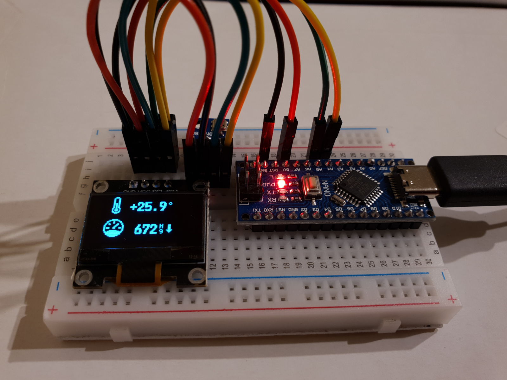

# AVR Meteo Station

## Components

- Temperature and pressure sensor - **BMP180**
- OLED Display - **SSD1306**
- AVR Atmega328P - **Arduino nano**

## Development

- [PlatformIO](https://platformio.org/)
- [Bitmap Editor](https://pkolt.github.io/bitmap_editor/)
